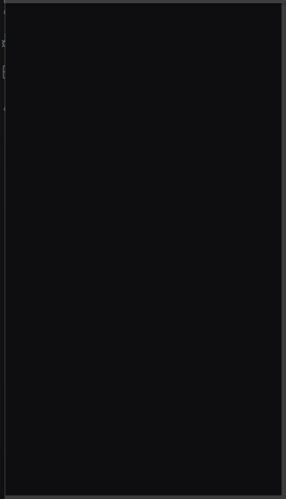

# Twitch WAP Selenium Pytest

## Requirements
- Python 3.10+
- Google Chrome
- ChromeDriver that matches your Chrome version

## Install
```bash
python -m venv .venv
source .venv/bin/activate  # mac/linux
# .venv\Scripts\activate   # windows

pip install -r requirements.txt

# Twitch WAP Automation

## Demo (running locally)



This GIF shows the test running locally:
- Open Twitch (WAP / mobile emulation)
- Search "StarCraft II"
- Scroll down twice
- Navigate to Channels
- Open a streamer